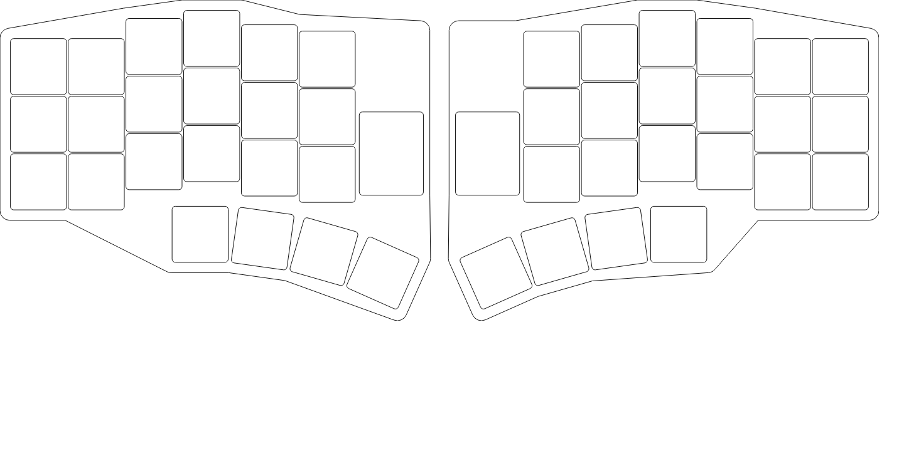
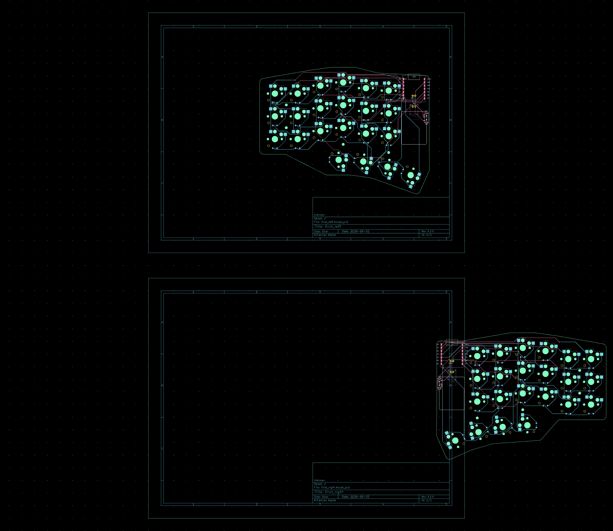

# first — 44キー分割無線キーボード (Ergogen → KiCad)

片側 22 キー（メイン 3行×6列 ＋ 親指 4キー）、Kailh Choc v2 ホットスワップ、
**Seeed XIAO nRF52840 Plus** の分割無線キーボード。`config.yaml` から Ergogen で
左右 2 枚の KiCad PCB を自動生成し、Freerouting による自動配線・DRC・ガーバー生成まで済んでいます。

| 全 44 キー配置 | 配線済み PCB (左/右) |
| --- | --- |
|  |  |

## 状態 (2026-09-02)

- `kicad/first_left.kicad_pcb` / `kicad/first_right.kicad_pcb` — **配線済み・DRC 違反 0・未配線 0**
- `gerbers/first_left.zip` / `gerbers/first_right.zip` — **発注用ガーバー**（JLCPCB 等にそのままアップロード可）

## 使い方

```sh
npm install          # ergogen をローカルにインストール
npm run build        # = ergogen . --clean   → output/ に未配線 PCB を再生成
npm run build:svg    # 外形 SVG も出力
```

> **注意**: `output/` はビルドのたびに完全に上書きされます。配線済みデータは `kicad/`、
> 発注データは `gerbers/` にあり、これらはビルドでは消えません。config を変更したら
> 「`npm run build` → `output/pcbs/*.kicad_pcb` を `kicad/` にコピー → 再ルーティング」が必要です。

## ディレクトリ構成

```
.
├── config.yaml              Ergogen 設定 = 回路の一次ソース (キー配置・外形・ネット定義)
├── footprints/
│   ├── ceoloide/            ceoloide/ergogen-footprints (Choc, ダイオード, JST, 電源SW 等) ※CC BY-NC-SA 4.0
│   └── local/mcu_xiao_nrf52840_plus.js   XIAO nRF52840 Plus (Seeed 公式 KiCad データの座標から作成)
├── output/                  Ergogen 生成物 (未配線。ビルドごとに上書き)
├── kicad/                   配線済み PCB (Freerouting + 手修正、DRC クリーン)
├── gerbers/                 発注用ガーバー zip
└── docs/                    プレビュー画像
```

## 設計メモ

- **配列**: 列は外側から `outer, pinky, ring, middle, index, inner`、行は下から `bottom, home, top`。
  Columnar stagger は pinky 基準で ring +6.3 / middle +8.8 / index +4.3 / inner +2.3 mm。
  親指 4 キーは `rotate: -90`、半径 140mm の円弧上に 8° ピッチで扇状配置。
- **左右別基板**: XIAO は USB・リセットボタンが上面にあるためリバーシブル化できず、
  左手用 (`first_left`) と右手用 (`first_right`) を別々に生成・配線しています。
- **実装面**: スイッチソケット・ダイオード = 裏面 / XIAO・JST・電源スイッチ = 表面。
  XIAO は castellated パッドで表面に直付け。バッテリー (502030) は MCU 下の「ベイ」裏面。
- **ピン割当 (ZMK: `&xiao_d n`)**
  | 用途 | ピン |
  |---|---|
  | 列 outer→inner | D0 D1 D2 D3 D4 D5 |
  | 親指 t1→t4 | D2 D3 D4 D5 (列を流用) |
  | 行 top / home / bottom / thumb | D9 / D8 / D7 / D6 |
  | 電源 | JST(BAT_P) → 電源SW → VBAT (モジュール裏パッド、基板のスルーホール経由で半田付け) |
  | リセット | XIAO 本体ボタン (1回=リセット、素早く2回=ブートローダ) |
  | 空き | D10 (+ Plus 裏面の D11〜D19) |
- **ダイオード**: 1N4148W (SOD-123)、col2row。帯マーク (カソード) が行ネット側。
- **マウントホール**: M2 NPTH ×4/枚。

## 発注 (JLCPCB の例)

1. [jlcpcb.com](https://jlcpcb.com) で `gerbers/first_left.zip` をアップロード → 2層 / 1.6mm / 1oz / HASL でそのまま注文 (最低5枚)
2. `first_right.zip` も同様に注文 (別設計扱い)
3. 部品: Choc v2 スイッチ×44、Choc ソケット×44、1N4148W×44+予備、XIAO nRF52840 Plus×2、
   JST PH 2P×2、電源SW (Alps SSSS811101)×2、502030 LiPo×2

## メンテナンスの流れ

回路図ファイル (.kicad_sch) は存在しません。**`config.yaml` が回路図に相当する一次ソース**で、
接続定義 (from/to) はすべてそこに書かれています。回路を変更するときは config を編集して再生成し、
Freerouting で再ルーティングします (このリポジトリの履歴と配線図ドキュメントを参照)。
