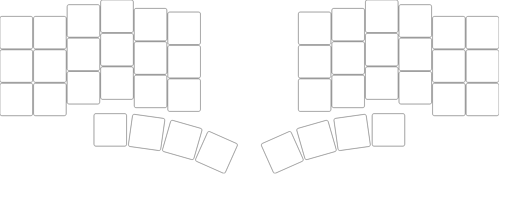
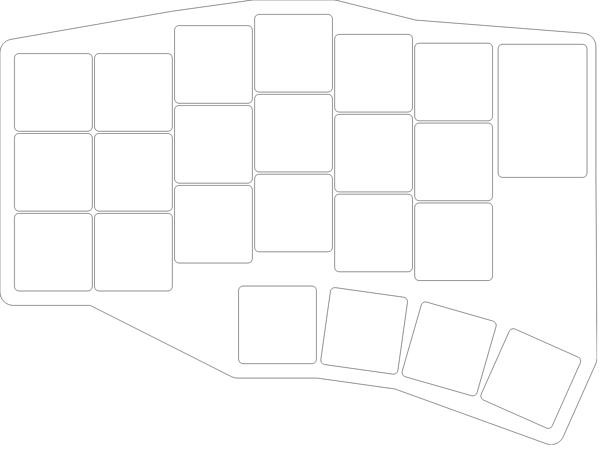
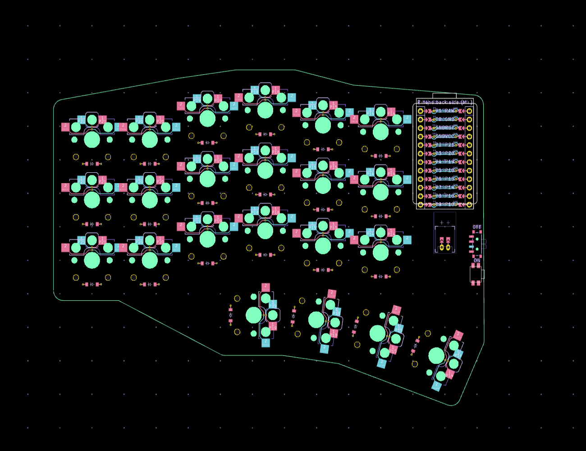

# first — 44キー分割無線キーボード (Ergogen → KiCad)

片側 22 キー（メイン 3行×6列 ＋ 親指 4キー）、Kailh Choc v2 ホットスワップ、
nice!nano v2 の分割無線キーボード。`config.yaml` から Ergogen で KiCad PCB を自動生成します。

| 全 44 キー配置 | 左手基板外形 (+バッテリー位置) | 生成 PCB (KiCanvas 描画) |
| --- | --- | --- |
|  |  |  |

## 使い方

```sh
npm install          # ergogen 4.2.1 をローカルにインストール
npm run build        # = npx ergogen . --clean   → output/ に生成
npm run build:svg    # 外形の SVG も出力
```

生成物:

```
output/
├── outlines/
│   ├── board.svg / .dxf     基板外形 (Edge.Cuts と同じ形状)。ケース設計の元データにも使える
│   ├── keys.svg / .dxf      全 44 キーの矩形 (左右両方) — レイアウト確認用
│   ├── battery.svg / .dxf   502030 LiPo の占有範囲 (20x30mm)
│   └── preview.svg / .dxf   外形 + キー + バッテリーを重ねたプレビュー
└── pcbs/
    └── first.kicad_pcb      KiCad 8 形式の基板データ (フットプリント配置・ネット定義済み、配線は未実施)
```

## ディレクトリ構成

```
.
├── config.yaml              Ergogen 設定 (キー配置・外形・PCB フットプリント/ネット)
├── footprints/ceoloide/     ceoloide/ergogen-footprints (Choc v1/v2, nice!nano, SOD-123 等) ※CC BY-NC-SA 4.0
├── docs/                    プレビュー画像
├── output/                  Ergogen の生成物 (上記)
└── package.json             ergogen 依存と build スクリプト
```

## 設計メモ

- **配列**: 列は外側から `outer, pinky, ring, middle, index, inner`、行は下から `bottom, home, top`。
  Columnar stagger は pinky 基準で ring +6.3 / middle +8.8 / index +4.3 / inner +2.3 mm (outer は pinky と同じ高さ)。
- **親指**: `matrix_index_bottom` を基準に 4 キー。各キーは `rotate: -90`、
  さらに 140mm 下の中心まわりに 8° ずつ回転させた円弧上に扇状配置。
- **マトリクス配線 (col2row, ダイオードは行側がカソード)**  
  列: outer=P21, pinky=P20, ring=P19, middle=P18, index=P15, inner=P14  
  行: top=P10, home=P16, bottom=P8, thumb=P9 (親指キーは隣接する列ネットを流用)  
  電源: JST PH 2pin (BAT_P/GND) → 電源スイッチ → RAW(B+)、リセット: RST–GND
- **リバーシブル**: すべてのフットプリントに `reversible: true` を指定しているので、
  同じ基板を裏返して右手側にも使えます (nice!nano はジャンパーで左右を選択)。
- **バッテリー**: 502030 (20x30x5mm) を MCU 直下の基板裏面に置く前提で、`Dwgs.User` レイヤーに
  ガイド矩形を出力しています。JST コネクタは裏面実装・開口部をバッテリー側に向けています。

## 次にやること

1. KiCad 8 以降で `output/pcbs/first.kicad_pcb` を開き、配線 (手配線または Freerouting) と DRC。
2. 必要に応じてマウントホール (`ceoloide/mounting_hole_npth`) を追加。
3. `output/outlines/board.dxf` を元にケース/プレートを設計。
